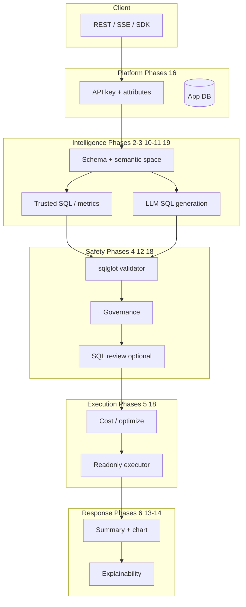

# InsightAI — Future Phases (Global Platform Roadmap)

> **Purpose:** Roadmap for Phases **11–20** — enterprise capabilities for a **general-purpose** analytics platform (any business), inspired by production patterns (e.g. Genie-style analytics), without abandoning InsightAI’s clean architecture.  
> **Deployment model:** **One instance = one customer / one business** (one schema, one readonly DB, one config set). The codebase stays industry-agnostic; each deployment customizes YAML/env — not multiple `projects/<id>/` inside a single running instance.  
> **Status:** **Planning only** — implement after [AGENT_PHASES.md](AGENT_PHASES.md) Phases 1–10 and alongside [BRAIN_PHASES.md](BRAIN_PHASES.md).  
> **Companion docs:** [AGENT.md](AGENT.md), [README.md](README.md), [BRAIN_PHASES.md](BRAIN_PHASES.md), [SECURITY.md](SECURITY.md)

---

## Table of contents

1. [Vision: global platform](#1-vision-global-platform)
2. [What is already done (baseline)](#2-what-is-already-done-baseline)
3. [Design principles (best practice)](#3-design-principles-best-practice)
4. [Phase overview](#4-phase-overview)
5. [Phase 11 — Trusted semantic layer](#phase-11--trusted-semantic-layer)
6. [Phase 12 — Governance & data policy](#phase-12--governance--data-policy)
7. [Phase 13 — Explainability & transparency](#phase-13--explainability--transparency)
8. [Phase 14 — Charts & structured results](#phase-14--charts--structured-results)
9. [Phase 15 — Task-level LLM router & cost control](#phase-15--task-level-llm-router--cost-control)
10. [Phase 16 — App database & API key auth](#phase-16--app-database--api-key-auth)
11. [Phase 17 — Feedback, evals & quality loop](#phase-17--feedback-evals--quality-loop)
12. [Phase 18 — SQL review, optimization & async jobs](#phase-18--sql-review-optimization--async-jobs)
13. [Phase 19 — Catalog, semantic spaces & lineage](#phase-19--catalog-semantic-spaces--lineage)
14. [Optional Phase 20 — Admin & analyst UI](#optional-phase-20--admin--analyst-ui)
16. [Cross-phase dependencies](#16-cross-phase-dependencies)
17. [Global constraints (all future phases)](#17-global-constraints-all-future-phases)
18. [Suggested implementation order](#18-suggested-implementation-order)
19. [Explicit non-goals](#19-explicit-non-goals)
20. [Document maintenance](#20-document-maintenance)

---

## 1. Vision: global platform

**InsightAI** today is a strong **NL → safe SQL → grounded answer** engine with hybrid RAG. To operate as a **general analytics platform** (deployable for any business — retail, healthcare, education, SaaS, etc.), each **single-tenant instance** needs layers that production systems proved:

| Layer | Question it answers |
|-------|---------------------|
| **Semantic / trusted** | “Is this answer backed by an approved metric or SQL asset?” |
| **Governance** | “May this principal see these rows/columns per **customer-defined** scope rules?” |
| **Explainability** | “Why did the system choose these tables and this SQL?” |
| **Operations** | “Can we dry-run, audit, cap cost, and approve risky SQL?” |
| **Auth** | “Which API key / role / attributes apply to this request?” |
| **Quality** | “Do we learn from mistakes without polluting global memory?” |

**Not in scope for one instance:** hosting multiple unrelated businesses in one process (no `projects/<id>/` registry). A **new customer** = **new deployment** (new env, schema, `config/`, Knowledge/) using the same InsightAI image/code.

Future phases add these capabilities **inside** `src/insightai/` (domain → application → infrastructure → `api/v1`), not as a flat monolith of micro-apps.

### End-state platform flow (after Phase 19; optional Phase 20 UI)

```text
Client (API / UI / SDK)
    → API key auth + principal attributes (Phase 16)
    → Optional semantic space filter (Phase 19)
    → Hybrid route: SQL | RAG | both (Phase 10)
    → Schema + Knowledge + lessons context (Phases 2, 10, Brain B)
    → Trusted metric / example SQL match OR LLM SQL (Phase 11)
    → SQL safety — sqlglot + composite (Phase 4)
    → Governance rewrite / deny (Phase 12)
    → Optional SQL review hold (Phase 18)
    → Cost check + execute readonly (Phases 5, 18)
    → Deterministic summary + optional LLM narrative (Phase 14+)
    → Chart spec + explainability payload (Phases 13–14)
    → Audit + metrics + feedback hook (Phases 8, 17)
```

### Mermaid — platform layers



Implementation must follow InsightAI conventions (ports, single FastAPI app, `prompts/`, **instance-level** `config/` — not 20 separate uvicorn entrypoints, and **not** multi-project routing inside one instance).

---

## 2. What is already done (baseline)

Do **not** re-implement these in future phases; **extend** them.

| Doc | Scope | Status |
|-----|--------|--------|
| [AGENT_PHASES.md](AGENT_PHASES.md) | Phases **1–10** — foundation through hybrid RAG | Core product ✅ |
| [BRAIN_PHASES.md](BRAIN_PHASES.md) | Knowledge + global **lessons** | A in practice; B–D planned |

| Capability | Phase |
|------------|-------|
| Clean architecture, FastAPI `/api/v1`, Docker | 1 |
| Schema markdown → context retrieval | 2 |
| NL → SQL (Groq / OpenAI / OpenRouter) | 3 |
| sqlglot + composite read-only validation | 4 |
| Readonly execution, row cap, timeout, MSSQL/PG/SQLite | 5 |
| Grounded answer generation | 6 |
| Chat, sessions, auth, rate limits, SSE | 7 |
| Audit, LLM usage, OTEL, Prometheus (optional) | 8 |
| Redis / memory caching | 9 |
| Hybrid RAG, `Knowledge/`, citations | 10 |

**MVP platform path (historical):** `1 → 2 → 3 → 4 → 5 → 6 → 7` then `8 → 9 → 10`.

**Global platform path (this doc):** `11 → 12 → 13` (trust + policy + transparency), then `14 → 15 → 16` (product + auth), then `17 → 18` (quality + ops), then `19` (catalog), optional `20` (UI).

---

## 3. Design principles (best practice)

Apply to **every** future phase:

### Architecture

1. **Hexagonal layout** — new behavior starts in `domain/` (models + ports), then `application/use_cases/`, then `infrastructure/`, then `api/v1/routes/`.
2. **One deployable API** — new surfaces are routers under `/api/v1/`, not new top-level `api/*.py` apps.
3. **Configuration as data** — instance-level YAML under `config/` (semantic, governance, LLM routes); secrets stay in env. **No** `projects/<id>/` in a single deployment.
4. **Schema source of truth** — `schema/database_schema.md` for this instance; catalog (Phase 19) indexes it, does not replace it.
5. **Industry-agnostic governance** — scope dimensions and mask rules are **declared in YAML**, not hardcoded (e.g. `campus` is one customer’s dimension name, not a platform concept).
6. **Prompts in `prompts/`** — versioned templates; no ad-hoc giant strings in routes.

### Security & trust

1. **Read-only execution** remains non-negotiable for AI paths.
2. **Governance is not optional** in production when row/column scope matters (Phase 12 before wide rollout).
3. **Trusted** answers require **exact or normalized SQL match** to approved assets — never “looks similar” alone.
4. **Lessons and feedback** require **approval** before global inject ([BRAIN_PHASES.md](BRAIN_PHASES.md) Phase B).
5. **Fail closed** — deny + audit on policy/validation errors; no silent downgrade to unscoped SQL.

### Operations

1. **Dry-run** on product chat for CI and prompt engineering (Phase 11).
2. **Structured audit** for every ask: project, user, route, tables, token/cost, outcome (extend Phase 8).
3. **Evals** as code — golden questions in `tests/evals/` (Phase 18), run in CI.
4. **Observability first** — metrics and traces for new steps before UI (Phase 20).
5. **API key first** — machine clients authenticate with scoped API keys (Phase 16); no requirement for browser login on the platform itself.

### What we avoid (anti-patterns)

| Avoid | Prefer |
|-------|--------|
| 20+ separate FastAPI apps | `api/v1` routers + shared `main.py` lifespan |
| Business logic in route files | Use cases + deps injection |
| 300k-line schema dump in git | Generated schema + catalog API |
| Unapproved auto-learning | Draft → approve → embed (Brain B) |
| LLM as security boundary | Validator + governance + readonly DB user |

---

## 4. Phase overview

| Phase | Name | Status | Depends on | Outcome |
|-------|------|--------|------------|---------|
| **11** | Trusted semantic layer | 🟡 In progress | 2, 3, 4, 7 | Approved metrics & example SQL; match-based trust |
| **12** | Governance & data policy | ⬜ Planned | 4, 5, 7, 16 | Configurable scope dimensions, PII masks, row filters |
| **13** | Explainability & transparency | ⬜ Planned | 2, 3, 6, 7 | `why` payload: tables, reasons, warnings, follow-ups |
| **14** | Charts & structured results | ⬜ Planned | 5, 6, 7 | Chart recommendation + tabular payload contract |
| **15** | Task-level LLM router & cost | ⬜ Planned | 1, 3, 8 | Per-task models, fallbacks, token budgets |
| **16** | App database & API key auth | ⬜ Planned | 7, 8 | Hashed API keys, roles, principal attributes for governance |
| **17** | Feedback, evals & quality loop | ⬜ Planned | 8, 10, 16, Brain B | `/feedback`, eval suites, curation → lessons |
| **18** | SQL review, optimization & async jobs | ⬜ Planned | 5, 12, 16 | Review queue, cost gate, background query jobs |
| **19** | Catalog, semantic spaces & lineage | ⬜ Planned | 2, 7 | Domain-scoped context, object metadata, lineage log |
| **20** | Admin & analyst UI (optional) | ⬜ Optional | 13, 16, 17 | Thin UI or external frontend; API remains primary |

Future phase numbers are **sequential after 10**. They do not replace Brain phases (A–D); Brain B–D should align with **Phase 17**.

**Removed from roadmap:** multi-project `projects/<id>/` inside one instance (Phase 15 former). Use separate deployments per customer instead.

---

## Phase 11 — Trusted semantic layer

**Status:** ✅ Complete — see [docs/PHASE_11_TRUSTED_SEMANTIC.md](docs/PHASE_11_TRUSTED_SEMANTIC.md)  

### Goal

Answers can be labeled **trusted** when SQL matches organization-approved metrics or example queries. Reduces LLM use for common questions and increases analyst confidence.

### Deliverables

| # | Component | Description |
|---|-----------|-------------|
| 1 | Semantic config port | Load `config/semantic/trusted_metrics.yaml`, `example_queries.yaml` for this instance |
| 2 | SQL normalizer | sqlglot canonical form for match (dialect-aware) |
| 3 | `MatchTrustedSQLUseCase` | Exact/normalized match → metric or example id |
| 4 | Rule-based SQL path | Optional template resolver for known metric names (no LLM) |
| 5 | Chat modes | `execute` (default), `dry_run` (generate + validate, no DB) |
| 6 | Response fields | `generation_source`, `trusted_asset_id`, `confidence` tier |
| 7 | CLI | `insightai-semantic-validate`, `insightai-semantic-test-match` |
| 8 | Tests | Fixture YAML; match/miss; dry_run does not execute |

### Proposed steps

| Step | Task | Status |
|------|------|--------|
| 11.1 | Domain models: `TrustedMetric`, `ExampleQuery`, `GenerationSource` enum | ✅ |
| 11.2 | `config/semantic/` layout + `config/semantic/README.md` template for any industry | ✅ |
| 11.3 | YAML loader in `infrastructure/semantic/` | ✅ |
| 11.4 | SQL normalizer + matcher (ports `ITrustedSQLMatcher`) | ✅ |
| 11.5 | Wire `GenerateSQLUseCase`: try trusted match before LLM when enabled | ✅ |
| 11.6 | Extend `ChatRequest`: `mode: execute \| dry_run`, `use_llm: bool` | ✅ |
| 11.7 | Extend chat/ask response schemas | ✅ (chat/ask/sql generate) |
| 11.8 | Optional starter pack: e.g. education metrics as **example** under `config/semantic/examples/education/` (not hardcoded in code) | ✅ |
| 11.9 | Unit + integration tests; update README | ✅ |

### Acceptance criteria

- [x] Question matching a trusted metric returns SQL from YAML without LLM when `use_llm=false`.
- [x] LLM-generated SQL that normalizes to approved SQL is marked `generation_source=trusted`.
- [x] `dry_run` never opens a readonly DB connection.
- [x] Non-matching questions fall through to existing Phase 3 path unchanged.

### Dependencies

- Phases 2, 3, 4, 7 ✅

---

## Phase 12 — Governance & data policy

**Status:** ✅ Complete — see [docs/PHASE_12_GOVERNANCE.md](docs/PHASE_12_GOVERNANCE.md), [docs/GOVERNANCE.md](docs/GOVERNANCE.md), [SECURITY.md](SECURITY.md) § Governance  

### Goal

Enforce **who can see what** at the data layer, not only “SELECT-only.” Policies are **fully configurable per deployment** — no hardcoded domain concepts (e.g. “campus” is only an example dimension for school customers, not part of the platform).

### Core concepts (industry-agnostic)

| Concept | Description | Example (education customer) | Example (retail customer) |
|---------|-------------|------------------------------|---------------------------|
| **Principal** | Caller identity from API key | key `analyst-east` | key `store-manager-42` |
| **Roles** | Named capability sets | `analyst`, `admin` | `analyst`, `regional_manager` |
| **Scope dimensions** | Named axes for row filtering | `campus_id`, `school_id` | `region_id`, `store_id` |
| **Principal attributes** | Values bound to dimensions | `campus_id: [1, 2]` | `store_id: [101]` |
| **Column masks** | Hide/hash PII columns | mask `email`, `phone` | mask `customer_email` |
| **Table allowlist** | Optional deny-by-default tables | exclude `payroll_*` | exclude `raw_payments` |

### Deliverables

| # | Component | Description |
|---|-----------|-------------|
| 1 | Policy model | `ScopeDimension`, `RowFilterRule`, `ColumnMaskRule`, `TablePolicy`, `RolePolicy` |
| 2 | `IGovernanceEnforcer` port | `enforce(sql, context) → EnforcedSQL \| Deny` |
| 3 | YAML policies | `config/governance/policies.yaml` — dimensions declared by **name** (customer-defined) |
| 4 | AST integration | Inject `WHERE` from dimension → column mapping in YAML; mask SELECT list |
| 5 | Principal context | API key (Phase 16) → `roles` + `attributes: dict[str, list[str]]` |
| 6 | Audit | `governance_denied`, `governance_modified`, `dimensions_applied[]` (Phase 8) |
| 7 | Tests | Generic fixtures: two dimensions, two roles; education example as **test data only** |

### Example policy sketch (not prescriptive)

```yaml
# config/governance/policies.yaml — each deployment defines its own dimensions
scope_dimensions:
  campus:
    description: "School site scope (example: education vertical)"
    sql_bindings:
      - table: school_school
        column: id
        operator: in_principal_attribute
        attribute: campus_ids
  # retail deployment might define:
  # store:
  #   sql_bindings: [{ table: dim_store, column: store_id, ... }]

roles:
  analyst:
    allowed_tables: ["*"]
    apply_scope: [campus]
    column_masks: [email, phone]
  admin:
    allowed_tables: ["*"]
    apply_scope: []
```

### Proposed steps

| Step | Task | Status |
|------|------|--------|
| 12.1 | Domain: `GovernanceContext`, `Principal`, `ScopeDimension`, `PolicyDecision`, `MaskRule` | ✅ |
| 12.2 | Port + infrastructure enforcer (sqlglot transform) | ✅ |
| 12.3 | YAML loader + schema validation for `config/governance/policies.yaml` | ✅ |
| 12.4 | Hook after Phase 4 validation, before Phase 5 execution | ✅ |
| 12.5 | Wire principal from API key auth (Phase 16); document attribute contract | ✅ |
| 12.6 | `docs/GOVERNANCE.md` — how to author policies for **any** vertical | ✅ |
| 12.7 | Security review checklist in [SECURITY.md](SECURITY.md) | ✅ |

### Acceptance criteria

- [x] Deployment can define arbitrary `scope_dimensions` without code changes.
- [x] Principal missing required attribute for a dimension → deny or empty-safe filter (policy-configurable).
- [x] Masked columns never appear in result columns for restricted roles.
- [x] Governance denial returns 403 with safe message (no SQL leak).
- [x] Read-only validator still runs on **post-governance** SQL.
- [x] Education “campus” example works when configured in YAML — not because campus is built into the engine.

### Dependencies

- Phases 4, 5, 7 ✅; Phase **16** for API key → principal attributes (can stub principal in tests before 16 ships)

---

## Phase 13 — Explainability & transparency

**Status:** ⬜ Planned  

### Goal

Every product answer can carry a machine-readable **“why”** for analysts and auditors.

### Deliverables

| # | Component | Description |
|---|-----------|-------------|
| 1 | `ExplainabilityPayload` model | Tables, join reasons, route, validation, warnings |
| 2 | Schema selection reasons | Expose `context_builder` boost/exclude notes (sanitized) |
| 3 | Follow-up suggestions | Optional LLM or heuristic `follow_up_questions[]` |
| 4 | API | `include_explainability` on chat/ask (default true for debug role) |
| 5 | SSE | Stream explainability before or with final answer |

### Proposed steps

| Step | Task |
|------|------|
| 13.1 | Domain model + port `IExplainabilityBuilder` |
| 13.2 | Implement from schema context + SQL gen + validation result |
| 13.3 | Wire into `AskUseCase` / `HybridAskUseCase` |
| 13.4 | Extend OpenAPI schemas; snapshot tests |
| 13.5 | Link to Phase 11 `generation_source` and Phase 12 policy ids |

### Acceptance criteria

- [ ] Response includes `referenced_tables` and `schema_selection_reasons` for SQL path.
- [ ] Validation issues appear in `warnings` without exposing raw stack traces.
- [ ] RAG path includes citation indices aligned with answer text.

### Dependencies

- Phases 2, 3, 6, 7, 10 ✅

---

## Phase 14 — Charts & structured results

**Status:** ⬜ Planned  

### Goal

Analytical answers include a **chart recommendation** and stable **tabular JSON** for frontends and exports.

### Deliverables

| # | Component | Description |
|---|-----------|-------------|
| 1 | `RecommendChartUseCase` | Heuristics: bar/line/pie/table from column types + cardinality |
| 2 | Chart spec | JSON schema (type, x, y, optional Vega-Lite subset) |
| 3 | Deterministic summarizer | Template summary before optional LLM narrative |
| 4 | `use_narrative` flag | LLM prose only when needed |
| 5 | Export | `GET` or chat field for CSV download token (optional) |

### Proposed steps

| Step | Task |
|------|------|
| 14.1 | Domain: `ChartRecommendation`, `TabularResult` |
| 14.2 | Heuristic recommender + tests on fixture result sets |
| 14.3 | `ResultSummarizer` infrastructure (non-LLM) |
| 14.4 | Integrate into answer pipeline; config thresholds |
| 14.5 | Document frontend contract in `docs/ANALYTICS_PAYLOAD.md` |

### Acceptance criteria

- [ ] Two-column numeric + label → `bar` recommendation.
- [ ] Single scalar aggregate → `table` or `metric` card.
- [ ] `use_narrative=false` still returns intelligible short summary.

### Dependencies

- Phases 5, 6, 7 ✅

---

## Phase 15 — Task-level LLM router & cost control

**Status:** ⬜ Planned  

### Goal

Route **sql_generation**, **answer**, **classification**, **embedding** to different models with fallbacks and spend caps — beyond a single `INSIGHTAI_LLM_PROVIDER`.

### Deliverables

| # | Component | Description |
|---|-----------|-------------|
| 1 | `ILLMRouter` port | `complete(task, messages) → response` |
| 2 | Policy YAML | `config/llm_router.yaml` for this instance |
| 3 | Fallback chains | Primary → secondary on timeout/rate limit |
| 4 | Budgets | Per-task max tokens / estimated USD (soft stop) |
| 5 | Metrics | Extend Phase 8 with `llm_task`, `model`, `cost_estimate` |

### Proposed steps

| Step | Task |
|------|------|
| 15.1 | Domain: `LLMTask`, `RoutePolicy`, `ModelRef` |
| 15.2 | Router impl delegating to existing Groq/OpenAI/OpenRouter providers |
| 15.3 | Wire into generate_sql, generate_answer, classify_route, embeddings |
| 15.4 | Admin API: `GET/PUT /api/v1/admin/llm-router` (admin API key) |
| 15.5 | Tests: fallback mock, budget exceeded → structured error |

### Acceptance criteria

- [ ] SQL gen and answer can use different models from one chat request.
- [ ] Budget exceeded returns 429 or degraded mode per policy (documented).
- [ ] Existing env-based provider still works as default route.

### Dependencies

- Phases 1, 3, 8 ✅

---

## Phase 16 — App database & API key auth

**Status:** ✅ Complete — see [docs/PHASE_16_APP_DB_AUTH.md](docs/PHASE_16_APP_DB_AUTH.md)  


### Goal

Persistent **platform** data (API keys, roles, attributes, SQL review records, feedback) separate from the **customer readonly** database. **Primary authentication: API key** — suitable for B2B integrations, internal tools, and gateways that hold identity.

### Deliverables

| # | Component | Description |
|---|-----------|-------------|
| 1 | App DB | Postgres (Alembic); SQLite for dev |
| 2 | API keys | Hashed at rest; prefix + secret; rotate/revoke |
| 3 | Key metadata | `roles[]`, `attributes: dict` (feeds Phase 12 governance), optional `label`, `expires_at` |
| 4 | Auth middleware | `Authorization: Bearer <key>` or `X-API-Key`; constant-time compare |
| 5 | Admin API keys | Separate high-privilege keys for `/api/v1/admin/*` |
| 6 | CLI | `insightai-keys create`, `revoke`, `list` |
| 7 | Migrations | `alembic/` under InsightAI repo |

### Out of scope (this phase)

- End-user signup/login UI (customer’s IdP or portal issues keys offline).
- OAuth/OIDC (optional later integration; callers may pass tokens **to** their gateway, not InsightAI directly).

### Proposed steps

| Step | Task | Status |
|------|------|--------|
| 16.1 | `INSIGHTAI_APP_DATABASE_URL` + Alembic bootstrap | ✅ |
| 16.2 | Domain: `ApiKey`, `Principal`, `Role` enum or string roles | ✅ |
| 16.3 | `IApiKeyStore` + bcrypt/argon2 hash; repositories | ✅ |
| 16.4 | Replace/extend Phase 7 JWT path: **API key required** for product routes (JWT optional legacy) | ✅ |
| 16.5 | Map key → `Principal` for governance (Phase 12) | ✅ |
| 16.6 | Rate limits keyed by `api_key_id` (extend Phase 7) | ✅ |
| 16.7 | Document in README + `.env.example` (`INSIGHTAI_API_KEY_*`) | ✅ |

### Acceptance criteria

- [x] Chat/ask without valid API key returns 401.
- [x] Key with `roles: [analyst]` and `attributes: { campus_ids: ["1"] }` passes principal to governance.
- [x] Revoked key fails immediately.
- [x] Customer DB credentials never stored in app DB tables.
- [x] Admin routes reject non-admin keys.

### Dependencies

- Phase 7 ✅; blocks Phase 18 review workflow; **required** for production governance (Phase 12)

---

## Phase 17 — Feedback, evals & quality loop

**Status:** ⬜ Planned  
aligns with [BRAIN_PHASES.md](BRAIN_PHASES.md) B–D.

### Goal

Close the loop: user feedback and CI evals improve the platform without unapproved global pollution.

### Deliverables

| # | Component | Description |
|---|-----------|-------------|
| 1 | `POST /api/v1/feedback` | issue_type, comment, expected_sql, rating |
| 2 | Curation store | Draft lesson or draft trusted query |
| 3 | Brain B integration | Approve → `insightai_lessons` pgvector |
| 4 | Eval harness | `tests/evals/*.yaml` golden questions |
| 5 | CI job | Regression: SQL match or snapshot answer |
| 6 | Promote flow | Approved feedback → example_queries.yaml PR |

### Proposed steps

| Step | Task |
|------|------|
| 17.1 | Feedback API schemas + persistence (app DB); auth via API key |
| 17.2 | Link negative feedback → Brain draft lesson |
| 17.3 | Implement Brain B store (if not done) per BRAIN_PHASES |
| 17.4 | `tests/evals/run_evals.py` + pytest marker `eval` |
| 17.5 | `docs/QUALITY_LOOP.md` for operators |

### Acceptance criteria

- [ ] `wrong_sql` feedback creates draft, not live inject.
- [ ] Approved lesson appears in SQL prompt for similar question (Brain B).
- [ ] Eval suite runs in CI with &lt; N minutes budget (configurable).

### Dependencies

- Phase 8, 10 ✅; Brain B; Phase 16 for persistence

---

## Phase 18 — SQL review, optimization & async jobs

**Status:** ⬜ Planned  

### Goal

High-risk or expensive SQL is gated, optimized, or run asynchronously with cancel support.

### Deliverables

| # | Component | Description |
|---|-----------|-------------|
| 1 | Risk scorer | Heuristics: missing WHERE, cross join, huge table scan |
| 2 | SQL review queue | pending → approved/rejected; role `sql_reviewer` |
| 3 | Cost controller | Pre-execution reject/warn (extends timeout/row cap) |
| 4 | Query jobs | `POST /chat/jobs`, poll, cancel |
| 5 | Worker | Background task (Redis queue or asyncio worker) |

### Proposed steps

| Step | Task |
|------|------|
| 18.1 | `SqlReviewDecider` + store (app DB) |
| 18.2 | Chat returns `review_required` without rows when pending |
| 18.3 | `QueryCostController` port + dialect-specific hints optional |
| 18.4 | Job store + worker + API routes |
| 18.5 | SSE progress events for jobs |

### Acceptance criteria

- [ ] Flagged SQL does not execute until approved.
- [ ] Job cancel stops worker before next fetch (best effort).
- [ ] Audit log links job id → sql hash → outcome.

### Dependencies

- Phases 5, 12 ✅; Phase 16 for review store

---

## Phase 19 — Catalog, semantic spaces & lineage

**Status:** ⬜ Planned  

### Goal

Data teams can scope analyst context to **domains** and trace what was queried over time.

### Deliverables

| # | Component | Description |
|---|-----------|-------------|
| 1 | Semantic spaces | YAML: allowed tables, tags, prompt overlay |
| 2 | Catalog API | List tables/columns from parsed schema + stewardship tags |
| 3 | Lineage log | question, sql_hash, tables, user, timestamp (app DB or JSONL) |
| 4 | Chat param | `semantic_space_id` filters Phase 2 context |
| 5 | Stewardship tags | Optional tags on schema objects (YAML sidecar) |

### Proposed steps

| Step | Task |
|------|------|
| 19.1 | `config/semantic_spaces.yaml` loader |
| 19.2 | Filter `BuildSchemaContextUseCase` by space |
| 19.3 | `GET /api/v1/catalog` |
| 19.4 | Lineage writer on successful execute |
| 19.5 | `GET /api/v1/lineage` (paginated, API key auth) |

### Acceptance criteria

- [ ] Space `finance` excludes configured tables from context (names are deployment-specific).
- [ ] Lineage entries queryable by API key principal and date range.
- [ ] Catalog matches `database_schema.md` parser output.

### Dependencies

- Phases 2, 7 ✅

---

## Optional Phase 20 — Admin & analyst UI

**Status:** ⬜ Optional  

### Goal

Optional thin UI for demos and operators; **API remains the contract of record**.

### Options (pick one per deployment)

| Option | Description |
|--------|-------------|
| A | Extend `apps/demo` — chat + explainability panel |
| B | Separate `insightai-ui` repo consuming OpenAPI |
| C | Document integration only; customers bring their UI |

### Minimum deliverables (if pursued)

- Chat with SQL toggle, sources, feedback buttons
- Admin: trusted metrics editor, governance YAML upload, lesson approval
- Env: `INSIGHTAI_API_URL` only; no secrets in frontend

### Dependencies

- Phases 13, 16, 17 recommended

---

## 16. Cross-phase dependencies

```text
Phases 1–10 (complete baseline)
    ├── Phase 16 (API key auth + app DB) — early for production APIs
    │       └── Phase 12 (governance ← principal attributes)
    │               └── Phase 18 (review + jobs)
    ├── Phase 11 (trusted + dry_run)
    │       └── Phase 12 (governance)
    ├── Phase 13 (explainability) — parallel after 11
    ├── Phase 14 (charts) — parallel after 6
    ├── Phase 15 (LLM router)
    ├── Phase 17 (feedback + evals + Brain B)
    ├── Phase 19 (catalog + spaces + lineage)
    └── Phase 20 (UI) — optional leaf

BRAIN_PHASES (A–D)
    └── Align B–D with Phase 17 (lessons + feedback + optional UI)
```

**Recommended global platform sequence:**

`11 → 16 → 12 → 13 → 14 → 15 → 17 → 18 → 19` → optional `20`

**Note:** Phase **16** before **12** so governance can bind real API key principals (12 can use test principals until 16 lands).

**Parallelizable:** 13 and 14 after 11; 15 after 11; Brain A continues throughout.

---

## 17. Global constraints (all future phases)

Inherit [AGENT_PHASES.md §14](AGENT_PHASES.md#14-global-constraints-all-phases), plus:

1. **Single tenant per instance** — one schema, one `config/`, one customer DB; scale customers by **new deployments**, not `project_id` routing.
2. **Governance dimensions are data-driven** — never hardcode `campus`, `school`, or vertical-specific names in Python; only in deployment YAML.
3. **Trusted ≠ safe** — trusted SQL still passes Phase 4 validator and Phase 12 governance.
4. **PII** — feedback and lessons redact by default; configurable in Phase 17.
5. **API keys** — treat as secrets; hash at rest; never log full key; support rotation.
6. **API versioning** — new fields are additive on `/api/v1`; breaking changes require v2 plan.
7. **Documentation** — each phase updates README, `.env.example`, and [AGENT.md](AGENT.md) changelog.
8. **Tests** — unit tests per use case; integration tests for dry_run, governance deny, trusted match, API key deny.

---

## 18. Suggested implementation order

When implementing with agents or step-by-step with maintainers:

| Order | Phase | Rationale |
|-------|-------|-----------|
| 1 | **11** | Trust + dry_run — immediate value, low risk |
| 2 | **16** | API key auth + app DB — foundation for governance and ops |
| 3 | **12** | Configurable governance — production data scope |
| 4 | **13** | Explainability — cheap, improves all clients |
| 5 | **14** | Charts + deterministic summary — product completeness |
| 6 | **15** | LLM router — cost control at scale |
| 7 | **17** | Feedback + evals + Brain B — quality loop |
| 8 | **18** | Review + async jobs — enterprise ops |
| 9 | **19** | Catalog + spaces + lineage — data platform maturity |
| 10 | **20** | UI — only when API contract is stable |

### Per-phase workflow (for agents)

1. Read this phase section + [AGENT.md](AGENT.md) + relevant Brain section.
2. Propose ports/models → **wait for approval** if scope is large.
3. Implement: domain → application → infrastructure → api → tests.
4. Run `./scripts/test.sh`.
5. Update phase status in **this file** §4 and [README.md](README.md) when user-facing.

---

## 19. Explicit non-goals

Not planned in Phases 11–20 (use external tools or separate repos):

| Non-goal | Reason |
|----------|--------|
| Multi-project / multi-customer in **one instance** (`projects/<id>/`) | One deployment = one business; reuse code via new instances |
| Write access to customer DB | Security model |
| Browser signup/login as default auth | API keys; customer IdP is external |
| Hardcoded vertical rules (campus, student, store) in Python | Only in `config/` + `Knowledge/` per deployment |
| Replacing customer BI (Power BI, etc.) | Export/chart JSON only |
| Full Databricks Unity Catalog clone | Phase 19 is minimal catalog |
| 20+ micro-API processes | Operational complexity |
| LLM fine-tuning / custom model training | Use router + lessons instead |
| Real-time streaming DB CDC | Out of scope |

---

## 20. Document maintenance

| When | Action |
|------|--------|
| Phase started | Set status ⬜ → 🟡 In progress in §4 |
| Phase complete | Set ✅; check acceptance boxes; update README status table |
| Scope change | Edit phase section + document history below |
| New inspiration | Add row to phase overview; do not duplicate Brain/Agent docs |

### Document history

| Date | Change |
|------|--------|
| 2026-05-21 | Initial FUTURE_PHASES.md: Phases 11–20 + optional 21; Genie-inspired platform roadmap |
| 2026-05-21 | Governance generalized (configurable scope dimensions); removed multi-project Phase 15; API key auth (Phase 16); renumbered 15–20 |
| 2026-05-21 | Phase 11 started — step 11.1 domain models; [docs/PHASE_11_TRUSTED_SEMANTIC.md](docs/PHASE_11_TRUSTED_SEMANTIC.md) |
| 2026-05-21 | Phase 11 step 11.2 — `config/semantic/` layout + YAML templates |
| 2026-05-21 | Phase 11 step 11.3 — `YamlSemanticCatalogLoader`, `INSIGHTAI_SEMANTIC_*` settings |
| 2026-05-21 | Phase 11 step 11.4 — `TrustedSQLMatcher`, `MatchTrustedSQLUseCase`, sqlglot normalizer |
| 2026-05-21 | Phase 11 step 11.5 — wire `GenerateSQLUseCase`, semantic bootstrap, API `generation_source` |
| 2026-05-21 | Phase 11 step 11.6 — chat/ask `mode` dry_run, `use_llm`, response trust fields |
| 2026-05-22 | Phase 11 complete — education example pack, semantic CLIs, acceptance tests |
| 2026-05-22 | Phase 16 step 16.1 — app DB URL, Alembic, `insightai-app-db` CLI |
| 2026-05-22 | Phase 16 steps 16.2–16.3 — API key models, bcrypt store, `insightai-keys` CLI |
| 2026-05-22 | Phase 16 step 16.4 — HTTP auth from app DB + env fallback |
| 2026-05-22 | Phase 16 complete — governance context, admin keys API, rate limits, docs |
| 2026-05-22 | Phase 12 step 12.1 — governance policy domain models + `config/governance/` template |
| 2026-05-19 | Phase 12 step 12.2 — SqlGovernanceEnforcer, YAML loader, bootstrap settings |
| 2026-05-19 | Phase 12 step 12.3 — governance validator CLI + bootstrap fail-fast |
| 2026-05-19 | Phase 12 step 12.4 — governed SQL pipeline hook in AskUseCase |
| 2026-05-19 | Phase 12 step 12.5 — principal attribute contract + JWT/keys wiring |
| 2026-05-19 | Phase 12 step 12.6 — docs/GOVERNANCE.md + education example pack |
| 2026-05-19 | Phase 12 step 12.7 — SECURITY.md governance checklist; Phase 12 complete |

---

## Quick links

- [AGENT_PHASES.md](AGENT_PHASES.md) — Phases 1–10 (shipped core)
- [BRAIN_PHASES.md](BRAIN_PHASES.md) — global lessons (A–D)
- [AGENT.md](AGENT.md) — implementation truth
- [README.md](README.md) — quick start
- [SECURITY.md](SECURITY.md) — production checklist
